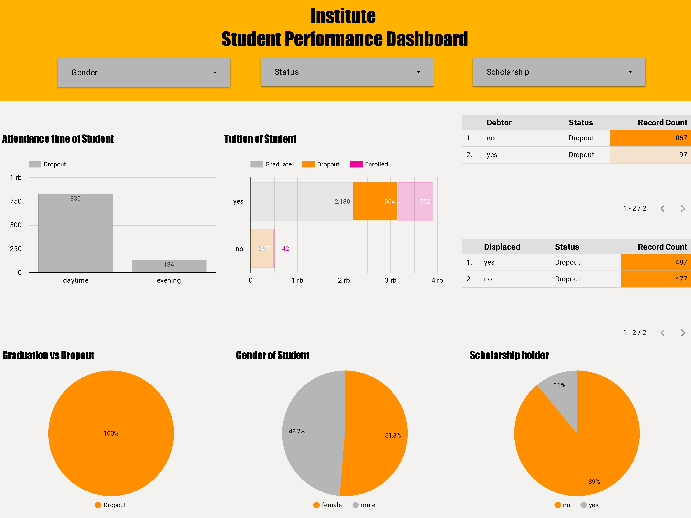

# Proyek Akhir: Menyelesaikan Permasalahan Perusahaan Edutech

## Business Understanding
Institut Jaya Jaya berdiri sejak tahun 2000. Hingga saat ini, ia telah mencetak banyak lulusan yang sangat dihormati. Akan tetapi, banyak siswa yang meninggalkan sekolah, atau dropout. Ini pasti menjadi salah satu masalah besar bagi institusi pendidikan. Akibatnya, Jaya Jaya Institut ingin mengidentifikasi siswa yang mungkin melakukan dropout secepat mungkin untuk memberikan bimbingan khusus.

### Permasalahan Bisnis
Banyak lembaga pendidikan menganggap dropout siswa sebagai masalah besar, yang dapat memengaruhi keuangan mereka dan reputasi perusahaan dalam jangka panjang. Sama halnya dengan Jaya Jaya Institut. Kita dapat membangun model klasifikasi untuk memprediksi kemungkinan seorang student meninggalkan sekolah dengan menggunakan data yang ada saat pendaftaran dan prestasi akademik mereka pada akhir semester pertama dan kedua. Sangat penting untuk menemukan variabel yang dapat memengaruhi keputusan untuk meninggalkan sekolah, seperti jalur akademik, demografis, dan sosial-ekonomi.

Penurunan angka kelulusan, peningkatan biaya karena kehilangan pendapatan siswa, dan kerusakan reputasi institusi adalah efek jangka panjang dari masalah ini. Institusi dapat mengantisipasi dropout dengan menggunakan model prediksi yang tepat untuk meningkatkan retensi siswa dan menciptakan lingkungan akademik yang lebih sukses.


### Cakupan Proyek
1. Pengumpulan dan Pemahaman Data: Dataset tersedia untuk proyek ini dan terlampir dalam folder "data.csv" atau melalui link ke dataset di bawah ini. Anda harus memahami struktur dan karakteristik data, seperti jenis variabel, jumlah data, dan nilai-nilai yang hilang atau tidak valid.

2. Analisis Data Eksplorasi (EDA): Eksplorasi data awal dilakukan untuk menemukan pola, tren, dan hubungan antar variabel. Visualisasi data dilakukan untuk memahami distribusi variabel dan menemukan anomali atau outlier.

3. Pembersihan dan Persiapan Data: Memperbaiki nilai-nilai dalam dataset yang tidak ada, duplikat, atau tidak valid; mengonversi variabel-variabel yang diperlukan menjadi format yang sesuai untuk analisis lebih lanjut; dan standarisasi atau normalisasi variabel numerik.

4. Analisis Faktor-Faktor yang Mempengaruhi Dropout: Cari variabel yang signifikan mempengaruhi penurunan dengan melakukan analisis statistik dan menemukan hubungan antar variabel dengan menggunakan teknik korelasi.

5. Pengembangan Model Prediksi Kegagalan siswa: Membagi dataset menjadi data latih dan data uji untuk mengembangkan model prediksi; menggunakan resampling "SMOTE", "Random Under Sampling", dan "Tanpa Resampling"; menerapkan PCA untuk mendapatkan komponen yang optimal; dan membuat dan melatih model prediksi menggunakan algoritma pembelajaran mesin. Untuk proyek ini, model pengajaran mesin digunakan: Random Forest, Logistic Regression, Decision Tree, XGB, Gradien Boosting, SVM, dan evaluasi performa model.


### Persiapan

Sumber data: <a href="https://github.com/dicodingacademy/dicoding_dataset/blob/main/students_performance/">Dataset Jaya Jaya Institut</a>

Setup environment:
```
pip install -r requirements.txt
```

## Business Dashboard

Dashboard ini mencakup berbagai metrik dan visualisasi, termasuk kehadiran mahasiswa baik di sesi siang maupun malam, serta status mahasiswa yang terbagi menjadi dropout, graduate, dan enrolled. Selain itu, dashboard menampilkan informasi terkait biaya kuliah yang berkisar antara 1-4 rb, dengan variasi status pembayaran.
Tidak hanya itu, melalui dashboard ini, pengguna dapat melihat komposisi student berdasarkan gender (51.3% perempuan dan 48.7% laki-laki), status debtor (867 non-debtor dan 97 debtor), displaced (487 displaced dan 477 non-displaced), serta status beasiswa dimana 89% mahasiswa tidak menerima beasiswa dan 11% menerima beasiswa.
Terdapat filter yang memungkinkan pengguna untuk memfilter data berdasarkan Gender, Status, dan Scholarship. Dengan memahami faktor-faktor yang mempengaruhi dropout yang mencapai 100%, Institut dapat mengambil langkah-langkah proaktif untuk memberikan pendampingan khusus kepada student yang berisiko dropout, terutama memperhatikan pola kehadiran yang sangat berbeda antara sesi siang dan malam, dengan tujuan mengurangi tingkat dropout dan meningkatkan tingkat kelulusan.

Business dashboard dapat diakses melalui link berikut: <a href="https://lookerstudio.google.com/u/0/reporting/b17a5c9c-e2e5-4dda-a753-780201d89fb3/page/ZM62D">Lookerstudio</a>

## Menjalankan Sistem Machine Learning
Untuk menjalankan aplikasi ini, kamu harus masuk ke folder (_directory_) yang sesuai dengan file `prediction.py` berada, kemudian masukkan command berikut dan tekan Enter:
```bash
streamlit run prediction.py
```
atau bisa akses di link berikut secara online: <a href="https://4fheqowfkzggbwkeohsagh.streamlit.app/">Streamlit</a>

## Conclusion
- Tingkat dropout siswa yang tidak menerima beasiswa cenderung lebih tinggi dibandingkan dengan siswa yang menerima beasiswa; ini menunjukkan betapa pentingnya mendapatkan dukungan keuangan untuk mendorong siswa untuk menyelesaikan pendidikan mereka.

- Mereka yang tertinggal dalam pembayaran biaya kuliah memiliki kemungkinan yang lebih tinggi untuk lulus, sementara siswa yang selalu membayar biaya kuliah memiliki kemungkinan yang lebih rendah untuk dropout. Sepertinya keberhasilan akademik berkorelasi dengan manajemen keuangan yang baik.

- Hasil akademik dipengaruhi oleh status pernikahan. Tingkat kelulusan siswa yang masih single cenderung lebih tinggi dibandingkan dengan siswa yang sudah menikah. Ini mungkin karena tanggung jawab tambahan yang ditanggung oleh siswa yang sudah menikah.

- Status perpindahan tidak sepenuhnya menentukan prestasi akademik, tetapi siswa yang tidak mengalami perpindahan cenderung memiliki tingkat retensi yang sedikit lebih rendah daripada siswa yang mengalami perpindahan.

- Tingkat dropout lebih tinggi untuk siswa yang mendaftar di usia lebih tua, terutama mereka di atas 23 tahun. Ini mungkin terkait dengan kesulitan menyesuaikan diri dengan lingkungan akademik setelah satu tahun sekolah formal.

- Mereka yang memiliki utang atau memiliki kinerja akademik yang buruk lebih rentan untuk dropout. Hutang dapat menjadi beban tambahan yang menghalangi mereka untuk maju dalam pendidikan mereka.

- Model Logistic Regression memiliki akurasi 90%, sedangkan SVM memiliki akurasi 92 persen. Namun, Logistic Regression lebih stabil daripada SVM dalam uji coba sebelumnya. Di sini, model utama yang digunakan untuk memprediksi status dropout dan lulus siswa adalah Logistic Regression. Model ini memiliki kemampuan untuk melakukan prediksi dan telah dipasang menggunakan Streamlit.


### Rekomendasi Action Items
- Untuk meringankan beban keuangan _student_ yang tidak mampu, Jaya Jaya Institut harus meningkatkan penawaran beasiswa dan bantuan keuangan lainnya. Beri prioritas kepada _student_ yang memiliki prestasi yang baik.

- Menciptakan sistem pengingat pembayaran atau program bantuan keuangan untuk siswa yang mengalami kesulitan membayar biaya kuliah mereka. Jika diperlukan, tambahkan opsi cicilan.

- Memberikan dukungan khusus untuk siswa yang sudah menikah atau bekerja, seperti pembelajaran yang dapat dilakukan secara online untuk memberikan fleksibilitas belajar.

- Memahami alasan perpindahan _student_ dan membuat program orientasi dan integrasi baru yang lebih baik.

- Menyediakan program transisi dan dukungan akademik tambahan untuk siswa yang kembali ke sekolah setelah jangka waktu satu tahun putus sekolah

- Menciptakan program bimbingan akademik dan manajemen utang yang komprehensif untuk membantu siswa mengatasi masalah keuangan dan meningkatkan kinerja akademik mereka.
